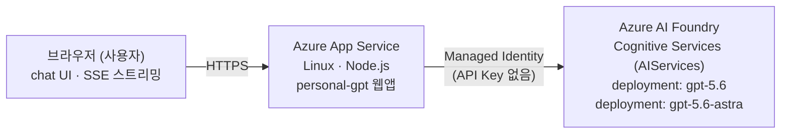

# personal-gpt

Azure AI Foundry에 배포한 `gpt-5.6` / `gpt-5.6-astra` 모델을 백엔드로 사용하는
ChatGPT 스타일 채팅 웹앱입니다. 인프라는 Terraform으로, 웹앱은 Node.js(Express)로
구성했습니다.

> 개인 역량 개발(학습) 목적의 프로젝트입니다. VNet/Private Endpoint 없이
> 공개 엔드포인트 기반의 단순 구성으로 만들었습니다.

## 아키텍처



- **인증**: App Service의 System Assigned Managed Identity에 Foundry 계정 스코프로
  `Cognitive Services OpenAI User` 역할을 부여해 API Key 없이 접근합니다.
- **스트리밍**: `/api/chat`이 Azure OpenAI Chat Completions 응답을
  Server-Sent Events(SSE)로 그대로 흘려보내 ChatGPT처럼 타이핑되듯 출력됩니다.
- **모델 전환**: 상단(사이드바) 드롭다운에서 배포된 모델(`gpt-5.6`, `gpt-5.6-astra`)을
  대화 중에도 전환할 수 있습니다.

## 리포지토리 구조

```
environments/dev/     # 실제 배포 대상 Terraform 루트 모듈 (dev 환경)
modules/
  resourcegroup/       # 리소스 그룹
  foundry/              # Azure AI Foundry(Cognitive Services AIServices) + 모델 배포
  appservice/           # 채팅 웹앱을 호스팅하는 Linux App Service (코드 배포)
  roleassignment/       # 범용 역할 할당 모듈 (Managed Identity → Foundry 권한 부여)
app/                   # 채팅 웹앱 소스 (Node.js / Express + 정적 프런트엔드)
  server.js              # /api/chat(SSE 스트리밍), /api/config 라우트
  public/                # 정적 HTML/CSS/JS (ChatGPT 스타일 UI)
.github/workflows/     # 웹앱 코드 배포용 GitHub Actions (수동 실행)
```

## 배포된 모델

| 배포 이름          | model_name        | model_version | 비고                          |
|--------------------|-------------------|---------------|-------------------------------|
| `gpt-5.6`           | `gpt-5.6`          | `2026-07-09`  | 기본 모델                     |
| `gpt-5.6-astra`     | `gpt-5.6-astra`    | `2026-07-09`  | gpt-5.6 계열 변형 모델        |

`capacity`(TPM 단위, 기본 1000)와 SKU는 `environments/dev/main.tf`에서 조정하세요.
구독의 실제 quota에 맞게 배포 전 반드시 확인이 필요합니다.

## 사전 준비물

- Terraform >= 1.6
- Azure CLI (`az login` 완료, 대상 구독 `a91975d8-17fa-48c4-bd6c-84dedd863785` 접근 권한)
- 대상 구독에서 Azure AI Foundry(Cognitive Services) 리소스 프로바이더 등록 및
  `gpt-5.6` / `gpt-5.6-astra` 모델 quota 확보
- Node.js >= 20 (로컬에서 웹앱을 직접 실행해볼 경우)

## 인프라 배포 (Terraform)

```bash
cd environments/dev

# 필요 시 terraform.tfvars.example을 복사해 값 조정
cp terraform.tfvars.example terraform.tfvars

terraform init
terraform plan
terraform apply
```

`azurerm_cognitive_account.name`, `azurerm_linux_web_app.name`은 Azure 전역에서
유일해야 합니다. 이름 충돌이 발생하면 `main.tf`의 `local.name_prefix` 값을
변경한 뒤 다시 배포하세요.

`terraform apply` 완료 후 아래 출력값을 확인할 수 있습니다.

- `webapp_url` : 채팅 웹페이지 접속 주소
- `foundry_endpoint` : Azure OpenAI 엔드포인트
- `foundry_deployment_names` : 실제 배포된 모델 이름 목록

## 웹앱 코드 배포

인프라(App Service)는 Terraform이 만들지만, 앱 코드는 별도로 배포해야 합니다.

### 방법 1) Azure CLI로 직접 zip 배포

```bash
cd app
npm install --omit=dev
zip -r ../app.zip . -x "node_modules/.cache/*"

az webapp deploy \
  --resource-group danny-personal-gpt-dev-rg \
  --name danny-personal-gpt-dev-app \
  --src-path ../app.zip \
  --type zip
```

### 방법 2) GitHub Actions (수동 실행)

`.github/workflows/deploy-app.yml`이 준비되어 있습니다.

1. Azure Portal에서 App Service > **게시 프로필 다운로드**
2. GitHub 리포지토리 Settings > Secrets and variables > Actions에
   `AZURE_WEBAPP_PUBLISH_PROFILE` 이름으로 등록
3. GitHub Actions 탭에서 `Deploy chat app to Azure App Service` 워크플로를 수동 실행(`workflow_dispatch`)

## 로컬에서 앱 실행

```bash
cd app
cp .env.example .env
# .env에 AZURE_OPENAI_ENDPOINT 등 값 채우기 (terraform output 참고)

npm install
az login   # AZURE_OPENAI_API_KEY를 쓰지 않는다면 Entra ID 인증을 위해 필요

npm start
# http://localhost:8080 접속
```

로컬에서 Managed Identity를 쓸 수 없으므로 `@azure/identity`의
`DefaultAzureCredential`이 `az login` 로그인 컨텍스트를 사용합니다.
API Key 방식으로 테스트하려면 `.env`의 `AZURE_OPENAI_API_KEY`만 채우면 됩니다
(운영 환경에서는 Managed Identity 사용을 권장).

## 리소스 정리

```bash
cd environments/dev
terraform destroy
```

## 참고

- 이 구성은 회사 프로젝트(`aide-dev` 환경)의 Terraform 모듈 스타일을 참고해
  개인 학습용으로 단순화한 것입니다 (VNet/Private Endpoint/ACR 등은 제외).
- 프로덕션 환경에서는 인증(로그인), Rate limit, 대화 이력 저장(DB) 등을
  추가로 고려해야 합니다. 현재는 세션 내 메모리(브라우저)에서만 대화 이력을 유지합니다.
